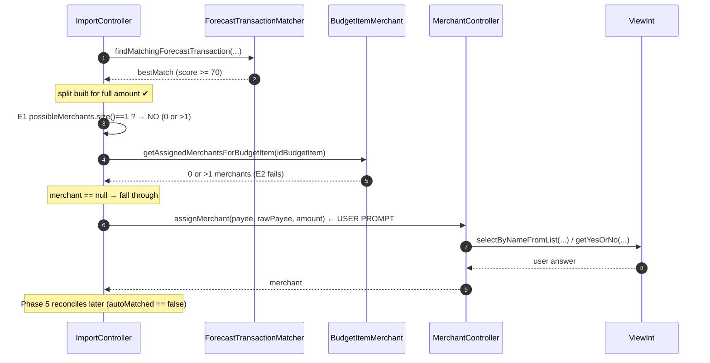

# Single-Transaction Import Algorithm

> **Purpose of this document**
> A shared reference describing exactly how ForecastEngine imports **one** transaction from a
> financial institution, so we can collaborate on analyzing and improving the algorithm.
> It traces the code as it exists today and flags observations/open questions at the end.
>
> Scope: the **cleared (posted) register import** path — goal `importRegisterTransactions`.
> The provisional (pending) import path and the "update forecast from external source" path
> are related but out of scope here.

> **Collaboration decisions (answers to §9):**
> 1. **Focus:** Improve the whole pipeline, **one phase at a time**; the current focus is
>    **Phase 2.5 (automatic forecast match)** — see the deep dive in §6A.
> 2. **Institution scope:** Stay **institution-agnostic** (Wells Fargo / Citi / Barclays / Generic
>    all treated equally). No institution-specific tuning in Phase 2.5.
> 3. **Formats:** **QFX and CSV are both first-class.** Phase 2.5 must behave identically for both.
> 4. **Correctness vs. UX:** Bias toward **fewer user prompts / more confident automation**
>    (while keeping the sign-gate and amount-tolerance safeguards that prevent bad matches).
> 5. **Known bugs:** Treated as **confirmed bugs to fix.** (The `j`-counter bug in §8.1 is now
>    **FIXED** — see the note there.)
> 6. **Detail level:** Include **sequence diagrams and concrete worked examples**, with extra
>    depth on Phase 2.5.

---

## 1. High-level flow

```
Main (goal="importRegisterTransactions")
  └─ MainController.run()  ── case "importRegisterTransactions"
       └─ ImportController.importRegisterTransactionFile()          ← ORCHESTRATOR
            ├─ FinancialInstitution.importRegisterTrxFile()         ← open parser (QFX/CSV)
            └─ while (financialInstitution.hasNext())               ← one iteration = one transaction
                 currentTransaction = financialInstitution.next()  ← PARSE + build Transaction
                 ├─ Phase 1  Identify new vs. already-imported
                 ├─ Phase 2  Reconcile with provisional (pending) txn
                 ├─ Phase 2.5 Auto-match to a forecast transaction
                 ├─ Phase 3  Identify / create merchant
                 ├─ Phase 4  Assign budget-item splits
                 └─ Phase 5  Reconcile with the forecast
       └─ (if forecast not in sync) ForecastController.updateForecast()
```

**Key architectural note (MVC):** the orchestrator (`ImportController`) and all sub-controllers
never talk to the user directly. Every prompt/log goes through the `ViewInt` interface, so the
same algorithm works for command line, Excel, etc.

---

## 2. Cast of characters

| Class / method | Role in a single import |
| -------------- | ----------------------- |
| `MainController.run()` | Dispatches the `importRegisterTransactions` goal. |
| `ImportController.importRegisterTransactionFile()` | **The orchestrator.** Runs the per-transaction phases. `src/main/java/.../controller/ImportController.java` (~line 304). |
| `FinancialInstitution` (abstract) | Opens the file and acts as an `Iterator<Transaction>`; converts raw QFX/CSV records into `Transaction` objects. `model/financialinstitution/FinancialInstitution.java`. |
| `WellsFargoBank` / `CitiBank` / `BarclaysBank` / `GenericBank` | Institution-specific parsing: `parseMerchantPayee()`, `getMatchingProvisionalTransaction()`, `extractUsers/AccountType/UserDescription()`, CSV format. Built by `FinancialInstitutionFactory`. |
| `QfxParser` | Loads the entire QFX/OFX file into memory (`QfxStatement`, `QfxTransaction`, ledger balance). |
| `RegisterController.resolveUnmatchedAccount()` | Resolves the *other* register for a transfer when the account number isn't in the payee. |
| `MerchantController.assignMerchant()` | Identifies or creates the `Merchant` from the payee (with user help). |
| `BudgetController.assignAmountsToBudgetItems()` | Produces the `TransactionSplit`s (budget-item allocations). |
| `ForecastTransactionMatcher` | Scores candidate forecast transactions for auto-matching (Phase 2.5). |
| `ForecastController.reconcile()` | Applies splits against forecast transactions (Phase 5). |
| `ImportLog` | Records/prints per-transaction outcomes and the final import summary. |

> ⚠️ **Note on the Strategy classes.** `ImportStrategy` / `QfxImportStrategy` / `OfxImportStrategy` /
> `QifImportStrategy` exist as an interface + skeletons, but the **active** cleared-import path does
> **not** use them — `QfxImportStrategy.importRegisterTransactions()` throws "not yet implemented."
> The real parsing lives in `FinancialInstitution` and its subclasses. (See open question Q6.)

---

## 3. Parsing a raw record into a `Transaction` (`FinancialInstitution.next()`)

`importRegisterTrxFile()` picks a parser by file extension:
- `.qfx` / `.ofx` → `importQfxRegisterTrxFile()` (loads whole file into memory, caches ledger balance).
- `.csv` / `.tsv` → `importCsvRegisterTrxFile()` (streamed via Apache Commons CSV; kept open during iteration).

Each `next()` call:
1. **QFX:** `convertQfxToTransaction(QfxTransaction)`
   - Post date `YYYYMMDD` → `Calendar`.
   - **Payee assembly:** for *transfer* NAME values (`ONLINE TRANSFER`, `RECURRING TRANSFER`,
     `ATM TRANSFER`, `SAVE AS YOU`, `TRANSFER IN BRANCH`), the `MEMO` is appended to `NAME`
     because Wells Fargo puts the masked account number (e.g. `XXXXXX7394`) in the MEMO.
   - `FITID` → `importRecordId` (the duplicate-detection key).
   - Amount, cleared=true, checkNumber=0.
   - `merchantPayee = parseMerchantPayee(date, amount, payee)` (institution-specific).
2. **CSV:** `convertCsvToTransaction(CSVRecord)` → institution's `createFromCSVRecord(...)`.

### 3a. `parseMerchantPayee()` — institution-specific normalization (Wells Fargo example)
Tokenizes the payee and branches on the leading phrase:
- **Purchases** (`PURCHASE AUTHORIZED ON`, `RECURRING PAYMENT AUTHORIZED`, …): skips the date/auth
  tokens and derives a clean merchant name from the remaining tokens.
- **Transfers** (`ONLINE/RECURRING/ATM TRANSFER …`, `SAVE AS YOU`): must identify the *other* register:
  1. Scan tokens for a masked account number matching `^X{4,}[0-9]{4}`.
  2. **If found:** `Register.getByLastFourDigits(last4)`.
  3. **If not found:** check a per-session cache (`payee|amount`), else call
     `RegisterController.resolveUnmatchedAccount(date, amount, payee, recurring)` to resolve it
     (see §5). Result (even `null`) is cached to avoid re-prompting within the session.
  4. Build a human-readable `merchantPayee` like `Transfer to <RegisterName> from <ThisRegister>`.

---

## 4. The per-transaction phases (`ImportController`)

For each `currentTransaction` produced by the iterator:

### Phase 1 — New vs. already-imported
- `importRecordId = currentTransaction.getImportRecordId()`.
- `existingTransaction = Transaction.getByImportRecordId(importRecordId, register.getId())`.
- `isNewTransaction = (existingTransaction == null)`.
- If it already exists, adopt the existing transaction, its `merchant`, and its `splits`
  (makes re-running an import **idempotent**).
- **First transaction only:** if it's older than a computed threshold (register's `lastImportDate − 30
  days`, or 7 days if never imported), ask the user to confirm before importing "old" data;
  declining throws `FileNotFoundException` to abort.

### Phase 2 — Reconcile with a provisional (pending) transaction
Only if splits aren't already assigned:
- `provisionalTransaction = financialInstitution.getMatchingProvisionalTransaction(currentTransaction)`.
- If found:
  - Adopt its merchant (or resolve `Merchant.getByPayee(...)` if it was `UNKNOWN`).
  - Adopt its splits.
  - `reconcileProvisionalTransaction(...)` transfers IDs/flags, and **detects a tip** (cleared −
    provisional > 1¢): adjusts register balance by the tip, records tip metadata, and adds the tip
    to the first split.
- **Balance update:** if there was *no* provisional match **and** the transaction is new,
  `register.balance += amount; register.update()`.

### Phase 2.5 — Automatic forecast match (skip if splits already exist)
- `possibleMerchants = MerchantUtilities.getPossibleMerchantsByPayee(merchantPayee)` (0/1/many).
- `matchedForecast = ForecastTransactionMatcher.findMatchingForecastTransaction(txn, forecast,
  possibleMerchants, 5, 5)` — ±5 day window, 70+ confidence required (see §6).
- If matched:
  - Build a single split to the matched forecast's budget item.
  - Determine the merchant: (1) unique payee→merchant mapping, else (2) the budget item's single
    assigned merchant (handles transfer payees with no direct merchant mapping).
  - **Only if a merchant was resolved:** save txn + split, immediately
    `ForecastController.reconcile(...)`, set `autoMatched = true`, and record the event.
  - If no merchant could be resolved, fall through to Phase 3 to ask the user.

### Phase 3 — Merchant identification (if still unknown)
- `merchant = merchantController.assignMerchant(merchantPayee, payee, amount)` (shared controller so
  its session cache persists across the whole import run).
- On user abort, the `terminationCondition` drives behavior:
  - `INQUIRE` → send a "please identify merchant" notification, `continue` to next txn.
  - `CANCEL` → skip this txn.
  - `SKIP` → assign the `UNKNOWN` merchant, save, update balance, `continue`.
  - `QUIT` → throw `QuitException`.
- Save the (now complete) transaction with `INSERT_ON_DUPLICATE_UPDATE`.

### Phase 4 — Budget-item split assignment (if splits not already present)
- `budgetItemsForMerchant = BudgetItemMerchant.getAssignedUnexpiredBudgetItems(budget, merchant)`.
- If empty → `budgetController.assignBudgetItemsToMerchant(...)`; if still empty, notify a user.
- `splits = budgetController.assignAmountsToBudgetItems(txn, merchant, budget, budgetItemsForMerchant)`.
- Same `CANCEL/SKIP/INQUIRE/QUIT` abort handling as Phase 3.
- Save each split (`INSERT_ON_DUPLICATE_UPDATE`). If splits came from a provisional txn, re-save any
  that are dirty (e.g., tip adjustment).

### Phase 5 — Forecast reconciliation (skip if `autoMatched`)
- Filter to splits **not** already reconciled (`ForecastTransactionSplit.getForecastTransactionSplit`).
- If any remain → `ForecastController.reconcile(currentTransaction, splitsToReconcile)`, which applies
  each split to a matching forecast transaction, decrements its remaining amount, and marks it found.

### Phases 6 & 7 — Post-processing & cleanup
- Phase 6 is a reserved TODO (significant-event processing).
- Phase 7: `versionFile(importFilePath)` (backup copy). `finally` always closes the institution iterator.
- After the loop: if `j > 0`, update `register.lastImportDate` and print a success summary.
- Returns `forecast.getInSync()`; the caller runs `updateForecast()` when out of sync.

---

## 5. Transfer register resolution (`RegisterController.resolveUnmatchedAccount`)

Used by Phase-3-of-parsing (§3a) when a transfer's account number is absent. It is
**session-cached** (payee+amount) and runs a cascade of narrowing filters, each of which either
resolves to exactly one register (confirmed by the user), narrows the candidate set, or continues:

1. Remove the current register from the candidate set.
2. Filter by **users + account type** extracted from the payee (`extractUsers`, `extractAccountType`).
3. If `recurring`, try the matching forecast transaction's most-recent reconciled merchant.
4. Match a register **nickname** token in the memo (`extractUserDescription`).
5. Most-recent transaction with the same payee+amount → confirm.
6. Full-text search over historical memos → confirm a single suggestion or present a list.
7. **Fallback:** present **all** remaining candidate registers for manual selection.

> This is the path recently changed so that ambiguous payees (e.g. `HIXON D`, which can map to more
> than one account) are **confirmed** rather than silently auto-selected, falling back to the full
> list on rejection. (`evaluateRegisterSet` now prompts instead of auto-returning.)

---

## 6. Forecast auto-match scoring (`ForecastTransactionMatcher`)

`findMatchingForecastTransaction(date, amount, forecast, possibleMerchants, daysBefore, daysAfter)`:
1. Collect forecast transactions in `[date−daysBefore, date+daysAfter]`.
2. Drop those already fully reconciled (`remainingAmount == 0`).
3. If `possibleMerchants` is non-empty, keep only forecasts whose budget item's merchants intersect
   (forecasts whose budget item has *no* assigned merchant are kept as candidates).
4. Score each candidate; return the best **only if score ≥ 70**.

`calculateMatchScore(...)` (0–100):
- **Sign gate (critical):** if `signum(txnAmount) != signum(forecastRemaining)` → score `0`
  (a deposit can never match an expense).
- **Date proximity (0–40):** `40 − 8 × businessDaysDiff` (business days, not calendar days).
- **Amount similarity (0–40):** ≤1% → 40; ≤5% → 40→20 ramp; ≤25% → 20→0 ramp; else 0.
- **Merchant bonus (0–20):** awarded **once** if a possible merchant matches the budget item's merchants.

Related guard: `AUTO_MATCH_AMOUNT_TOLERANCE = 0.05` and `isAmountWithinAutoMatchTolerance(...)` are the
shared definition of "amounts too different to auto-assign," used so a candidate that matches on
merchant/date but differs materially in amount is confirmed rather than silently assigned.

---

## 6A. Phase 2.5 deep dive (current focus)

> This section zooms all the way in on **Phase 2.5 — Automatic forecast match**, the step whose job
> is to import a transaction with **zero user prompts** when we're confident it corresponds to a
> planned forecast transaction. It is institution-agnostic (§9.2) and runs identically for QFX and
> CSV, because by the time we reach Phase 2.5 the raw record is already a normalized `Transaction`.

### 6A.1 Where the code lives

| Concern | Location |
| ------- | -------- |
| Orchestration (build split, resolve merchant, save, reconcile) | `controller/ImportController.java` lines **408–490** |
| Candidate search + scoring gate (≥70) | `utility/ForecastTransactionMatcher.java` `findMatchingForecastTransaction(...)` lines **122–227** |
| Per-candidate score (0–100) | `utility/ForecastTransactionMatcher.java` `calculateMatchScore(...)` lines **290–375** |
| Payee → possible merchants | `model/merchant/MerchantUtilities.java` `getPossibleMerchantsByPayee(...)` lines **44–75** |
| Transfer → merchant via last-four | `model/merchant/MerchantUtilities.java` `getTransferMerchantByLastFour(...)` / `extractMaskedAccountLastFour(...)` |
| Immediate reconciliation | `controller/ForecastController.java` `reconcile(...)` lines **399–488** |

### 6A.2 Preconditions (when Phase 2.5 actually runs)

Phase 2.5 only executes when **all** of these hold (see `ImportController` lines 366 & 411):

- The transaction had **no pre-existing splits** from a prior import run (`splits == null` after
  Phase 1's idempotency adoption), **and**
- Phase 2 found **no matching provisional transaction** (so `splits` is still `null`).

If either produced splits, we already know the budget-item allocation and skip auto-match entirely.

### 6A.3 Exact algorithm (as implemented today)

```
INPUT: currentTransaction (normalized), forecast, register
STEP A  possibleMerchants = MerchantUtilities.getPossibleMerchantsByPayee(payee)
          → exact merchant_payee match ? [that one]
          → else fuzzy LIKE on merchant name ? [0..N]
STEP B  matchedForecast = ForecastTransactionMatcher.findMatchingForecastTransaction(
                              txn, forecast, possibleMerchants, daysBefore=5, daysAfter=5)
          1. candidates = forecast txns with plannedDate in [date-5, date+5]
          2. drop candidates with remainingAmount == 0   (already reconciled)
          3. IF possibleMerchants non-empty:
                keep candidate IF its budget item has NO merchants (still eligible)
                              OR its budget item shares a merchant with possibleMerchants
          4. score every survivor with calculateMatchScore(); keep best
          5. RETURN best IFF bestScore >= 70, else null
STEP C  IF matchedForecast == null → fall through to Phase 3 (manual merchant prompt)
STEP D  idBudgetItem = matchedForecast.forecastItem.idBudgetItem
        splits = [ TransactionSplit(fullAmount, idBudgetItem, txnId, memo=null) ]
        view.sayH3("Auto-matched to forecast transaction: …")     ← informational, not a prompt
STEP E  resolve merchant, in priority order:
          E0. transfer via last-four: if the raw payee carries a masked counterparty account
              number (e.g. "…XXXXXX8249…" or "…****8249…"),
              MerchantUtilities.getTransferMerchantByLastFour(payee, register):
                  last4 → Register.getByLastFourDigits → Merchant.getByName(register.name)
                  (creates the merchant named after the register if none exists; ignores a match
                   to the register being imported). Deterministic + institution-agnostic.
          E1. else possibleMerchants.size()==1 → that merchant
          E2. else merchants assigned to idBudgetItem; if exactly 1 → that merchant
          E3. else merchant stays null
STEP F  IF merchant != null:
          save txn (INSERT_ON_DUPLICATE_UPDATE); save split(s)
          ForecastController.reconcile(txn, splits)   ← decrements remainingAmount, links split
          autoMatched = true; importLog.recordImportEvent(NEWLY_IMPORTED)
        ELSE:
          keep splits, fall through to Phase 3 (prompt for merchant), Phase 5 reconciles later
```

**`calculateMatchScore` (0–100), unchanged summary:**

| Component | Points | Rule |
| --------- | -----: | ---- |
| **Sign gate** | — | `signum(txn) != signum(forecastRemaining)` ⇒ **score 0** (hard veto) |
| Date proximity | 0–40 | `40 − 8 × businessDaysDiff` (business days, floored at 0) |
| Amount similarity | 0–40 | ≤1% ⇒ 40; ≤5% ⇒ `40 − pct·400`; ≤25% ⇒ `20 − pct·80`; else 0 |
| Merchant bonus | 0 or 20 | awarded **once** if a possible merchant ∈ budget-item merchants |

Threshold to auto-assign: **`bestScore ≥ 70`**.

### 6A.4 Sequence diagram — the happy path (auto-matched, no prompts)

```mermaid
sequenceDiagram
    autonumber
    participant IC as ImportController
    participant MU as MerchantUtilities
    participant FTM as ForecastTransactionMatcher
    participant FU as ForecastTransactionUtilities
    participant BIM as BudgetItemMerchant
    participant FC as ForecastController
    participant V as ViewInt

    Note over IC: Phase 2.5 entered (splits == null)
    IC->>MU: getPossibleMerchantsByPayee(payee)
    MU-->>IC: possibleMerchants [0..N]
    IC->>FTM: findMatchingForecastTransaction(txn, forecast, possibleMerchants, 5, 5)
    FTM->>FU: getForecastTransactionsInDateRange(forecastId, date-5, date+5)
    FU-->>FTM: candidates
    FTM->>FTM: drop remainingAmount==0
    FTM->>BIM: getAssignedMerchantsForBudgetItem(...) (per candidate, if merchants known)
    BIM-->>FTM: merchants
    FTM->>FTM: calculateMatchScore() per survivor (sign gate + date + amount + merchant)
    FTM-->>IC: bestMatch (score >= 70) or null
    Note over IC: match found → build split for full amount
    IC->>V: sayH3("Auto-matched to forecast transaction: …")
    Note over IC: resolve merchant E0(transfer last-four)→E1→E2→E3
    IC->>IC: merchant != null?
    IC->>FC: reconcile(txn, splits)
    FC-->>IC: forecast remainingAmount decremented, split linked
    IC->>IC: autoMatched = true; recordImportEvent(NEWLY_IMPORTED)
    Note over IC: Phase 3/4/5 all SKIPPED for this txn
```

### 6A.5 Sequence diagram — confident match but merchant unresolved (still prompts)

This is the UX gap called out in §8.5: the forecast match is confident, but neither E1 nor E2
yields a unique merchant, so we still drop to a manual prompt.



### 6A.6 Worked examples

Assume today's import file has these three rows and the forecast contains the listed planned
transactions. Register is a checking account.

#### Example 1 — Clean auto-match (0 prompts) ✅

- **Cleared txn:** `PURCHASE AUTHORIZED ON 08/10 NETFLIX.COM` — amount **−$15.99**, date **2026-08-11**.
- **`possibleMerchants`:** exact `merchant_payee` hit → **[Netflix]** (size 1).
- **Forecast candidate:** "Netflix subscription", budget item *Streaming*, plannedDate **2026-08-12**,
  remaining **−$15.99**.
- **Score:** sign OK (both negative). Date = 1 business day ⇒ `40 − 8 = 32`. Amount 0% diff ⇒ `40`.
  Merchant bonus (Netflix ∈ Streaming's merchants) ⇒ `20`. **Total = 92 ≥ 70.** ✔
- **Merchant resolve:** E1 succeeds (single possible merchant = Netflix).
- **Outcome:** split → *Streaming*; `reconcile` zeroes the forecast's remaining; `autoMatched = true`.
  **No prompts.** Phases 3/4/5 skipped.

#### Example 2 — Transfer resolved deterministically from the masked account number (0 prompts) ✅

- **Cleared txn:** `Transfer to XXXXXX8249 from Bill Pay Danni` — amount **−$500.00**, date **2026-08-11**.
- **`possibleMerchants`:** no `merchant_payee` row, fuzzy LIKE finds nothing ⇒ **[]** (empty).
- **Candidate filtering:** with an *empty* merchant list, `findMatchingForecastTransaction` does **no**
  merchant filtering — every date-window candidate stays eligible.
- **Forecast candidate:** "Monthly transfer to savings", budget item *Savings Transfer*, plannedDate
  **2026-08-10**, remaining **−$500.00**.
- **Score:** sign OK. Date = 1 business day ⇒ `32`. Amount 0% ⇒ `40`. Merchant bonus **0** (empty
  possibleMerchants ⇒ merchant component skipped). **Total = 72 ≥ 70.** ✔
- **Merchant resolve:** **E0 succeeds.** The raw payee contains the masked token `XXXXXX8249`;
  `extractMaskedAccountLastFour` → `8249` → `Register.getByLastFourDigits("8249")` → the **Bill Pay Dave**
  register → merchant `Merchant.getByName("Bill Pay Dave")` (created on the fly if it didn't exist yet).
- **Outcome:** auto-matched, **no prompts**, and the merchant is correctly the counterparty account
  ("Bill Pay Dave") rather than a generic/ambiguous guess. E2 (budget-item merchant) is no longer even
  needed for this case.

#### Example 3 — Confident date/amount but ambiguous merchant (still 1 prompt) ⚠️

- **Cleared txn:** `HIXON D ONLINE TRANSFER` — amount **−$250.00**, date **2026-08-11**.
- **`possibleMerchants`:** fuzzy match returns **[Transfer-Checking, Transfer-Savings]** (size 2).
- **Forecast candidate:** "Recurring transfer", budget item *Family Transfers*, plannedDate
  **2026-08-12**, remaining **−$250.00**, budget item has **two** merchants assigned.
- **Score:** sign OK, date `32`, amount `40`, merchant bonus `20` (one of the two matches). **= 92.** ✔
- **Merchant resolve:** **E0** doesn't fire (payee `HIXON D ONLINE TRANSFER` has **no masked account
  number** to key off). E1 fails (size 2). **E2** fails (budget item has 2 merchants). merchant stays
  `null`.
- **Outcome:** split is built and correct, but we **fall through to Phase 3 and prompt the user** to
  pick the merchant. Per decision §9.4 (fewer prompts) this is a candidate improvement — see §6A.7.

#### Example 4 — Correctly *rejected* (safety) 🛑

- **Cleared txn:** `DEPOSIT MOBILE` — amount **+$500.00**, date **2026-08-11**.
- **Forecast candidate:** "Electric bill", budget item *Utilities*, plannedDate **2026-08-12**,
  remaining **−$125.00**.
- **Score:** **sign gate fires** (`+` vs `−`) ⇒ **0**. No other candidate ≥ 70. Returns `null`.
- **Outcome:** falls through to normal merchant/split flow. This is the intended safeguard and must be
  preserved by any future change.

### 6A.7 Phase 2.5 improvement backlog (aligned to "fewer prompts", §9.4)

Ordered roughly by value ÷ risk. None of these are implemented yet — they're for our discussion.

1. **Close the "confident-match-but-ambiguous-merchant" gap (Example 3).** ✅ **Partly done.** The
   most common sub-case — **transfers** — is now handled deterministically by **E0**
   (`MerchantUtilities.getTransferMerchantByLastFour`): the masked counterparty account number in the
   raw payee resolves to a register, and the merchant is that register's name (created if absent).
   The **remaining** gap is a confident match whose payee has **no** masked account number *and* no
   unique payee/budget-item merchant (Example 3, `HIXON D`). Options for that residual case:
   (a) if the budget item has ≥1 merchant, **prompt only among that budget item's merchants** (a much
   shorter, pre-filtered list) instead of the full merchant assignment flow; or
   (b) introduce a **"transfer/forecast merchant"** notion so the split can be saved and reconciled
   even when the merchant is genuinely ambiguous, deferring merchant tagging to a later low-priority
   step. Either reduces prompts without weakening the sign/amount safeguards.
2. **Make the ±5 day window and 70 threshold configurable** (per-register or app setting) rather than
   hard-coded at `ImportController` line 420 / `ForecastTransactionMatcher` line 222. Lets us tune
   automation confidence without code changes, institution-agnostically.
3. **Tie-break on equal scores.** `findMatchingForecastTransaction` keeps the first best score
   (`score > bestScore`), so ties are resolved by candidate order (DB order). Add a deterministic
   tie-break (closest date, then closest amount, then nearest-future planned date) so behavior is
   reproducible and defensible.
4. **Reuse the resolved merchant for a payee→merchant mapping.** After an auto-match resolves a
   merchant via E2 for a payee that had **no** `merchant_payee` row, optionally persist that mapping
   so the *next* identical payee resolves via E1 with a merchant bonus — compounding automation.
5. **Unify the two amount tolerances.** `calculateMatchScore` bakes in its own 1%/5%/25% ramp while
   `isAmountWithinAutoMatchTolerance` defines a separate 5% gate; make the scoring ramp reference the
   shared constant so "too different to auto-assign" has one definition.
6. **Log the score/decision to the ImportLog** (why matched / why not) to make auto-match auditable —
   supports both "fewer prompts" and "trust the automation" goals.

---

## 7. Idempotency, balance & control flow

- **Duplicate protection:** `(importRecordId, registerId)` uniquely identifies a transaction, so a
  re-run adopts the existing row instead of double-importing.
- **Balance is mutated in several places:** Phase 2 (new, no provisional), Phase 2 tip adjustment,
  Phase 3 `SKIP` branch. (See open question Q4.)
- **User escape hatches are exceptions:** `CancelException`, `SkipException`, `QuitException`
  (gated by `ALLOW_*` flags) propagate up; the top level catches `Quit`/`Cancel`.
- **Persistence:** hand-written SQL via entities; `INSERT_ON_DUPLICATE_UPDATE` is used throughout so
  each phase can save incrementally.

---

## 8. Observations & candidate improvements (for our discussion)

These are things worth analyzing — **not** yet changed:

1. **`j` counter is never incremented.** ✅ **FIXED.** In `importRegisterTransactionFile()`,
   `int j = 0;` is used in error messages ("…after j transaction(s)"), in the final `if (j > 0)`
   block that updates `register.lastImportDate`, and in the success summary — but nothing ever
   did `j++`. As written, `lastImportDate` was **never** updated and the success line **never**
   printed, which also undercut Enhancement 6's "old transaction" threshold. **Fix:** `j++` is now
   executed at the end of each fully-processed transaction (just before `} // End while hasNext()`),
   so transactions that skip via an early `continue` (CANCEL/SKIP/INQUIRE) are intentionally not
   counted, while imported/adopted transactions are.
2. **Two separate transfer caches.** There's a session cache in `WellsFargoBank.parseMerchantPayee`
   *and* one in `RegisterController` keyed slightly differently (`%.2f` amount vs. raw amount).
   Worth consolidating to a single source of truth.
3. **Strategy pattern is dead code for QFX import.** `QfxImportStrategy` etc. throw "not implemented";
   real parsing is in `FinancialInstitution`. Either wire them up or remove them to reduce confusion.
4. **Balance-update placement is scattered** across phases and special-cases (`SKIP`, tips). A single
   well-defined "apply to balance" step would be easier to reason about and test.
5. **Auto-match merchant fallback can leave the txn unmatched** even when the forecast match is
   confident — if neither a unique payee→merchant nor a single budget-item merchant exists, it drops
   to a full manual prompt. Is that the desired UX?
6. **Phase 6 is a TODO.** Significant-event processing (e.g., overspend alerts) is unimplemented.
7. **Error granularity:** a parse/DB error on one transaction throws out of the whole loop
   (wrapped as `ControllerException`), aborting the remaining file rather than skipping one row.

---

## 9. Clarifying questions

> ✅ **Answered** — see the "Collaboration decisions" block near the top of this document. Current
> focus is **Phase 2.5** (§6A); stay institution-agnostic; QFX + CSV both first-class; bias to fewer
> prompts; known bugs are confirmed fixes (the `j`-counter bug is done). Kept below for history.

1. **Focus area:** Do you want to improve the *whole* pipeline, or zoom in on a specific phase
   (e.g., Phase 2.5 auto-match scoring, or §5 transfer resolution)?
2. **Institution scope:** Is Wells Fargo the primary institution to optimize for, or should the
   analysis stay institution-agnostic (Citi/Barclays/Generic too)?
3. **Formats:** Is QFX the format that matters in practice right now, or do CSV/OFX/QIF also need
   first-class attention?
4. **Correctness vs. UX:** Are we primarily after fewer user prompts (more confident automation),
   or safer/more auditable behavior (more confirmations)? These pull in opposite directions.
5. **Known bugs:** Should I treat the observations in §8 (especially the `j`-counter / `lastImportDate`
   issue) as confirmed bugs to fix, or just document them for now?
6. **Level of detail:** Is this the right altitude, or would you like sequence diagrams and/or
   concrete worked examples (e.g., a real transfer payee traced end-to-end) added?

---

*Source anchors:* `controller/ImportController.java` (orchestrator, ~line 304),
`model/financialinstitution/FinancialInstitution.java` (parser/iterator),
`model/financialinstitution/WellsFargoBank.java` (`parseMerchantPayee`, ~line 262),
`controller/RegisterController.java` (`resolveUnmatchedAccount`),
`utility/ForecastTransactionMatcher.java` (scoring).


